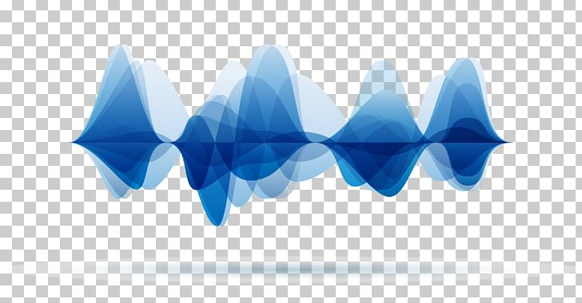

# Voice Toolbox 
The place to solve all your audio signal processing needs. 

The current repo is under **construction**. Goal is to create a repository that contains all voice signal processing functions available from different open source projects and libraries, such as parsel mouth and librosa. 

## Files
**To start**: Setup a conda environment and run 'pip3 install -r requirements.txt' before running the available scripts. 
>> **Important**: if you get an error with parselmouth make sure the installation is 'pip3 install praat-parselmouth'

________________________________________________________________________________________________________________________
The script for extracting features is parsel_process.py. 
 * **To run**: "python3 feature_extraction.py [sampling rate] [filepath] [output filepath] --[feature flag]"
 
 > **feature flags**: formants, ZCR, harmonics, rate_of_speech, loudness, pitch_features, spectral_features, energy

### **Features currently availabe**:
1. *Spectral Features*:
* pitch
* pitch range
* spectral slope
* mel-frequency cepstral coefficients (MFCC)
* mean spectral roll-off
* max jump (jump in pitch)
* peak to valley (mean distance between pitch peak and pitch valley)
* median F0 (fundamental frequency)

2. *Rate of Speech* and *loudness*:
* max intensity
* mean intensity
* syllables per second
* pause rate
* energy

3. *Harmonics*
* harmonics to noise (HNR)
* Formants: f1,f2, f3, f4
* number of zero crossings (ZCR)

### Extra Scripts for processed features
For visualization:
 1. visualize_voice.py for all scatter plots along with other plotting features from praat. 
 * To run: 'python3 visualize_voice.py'
 2. radar_plot.py for all radar plots
 * To run: 'python3 radar_plot.py'

For PCA analysis of voice data:
 voice_pca.py is for PCA, RFE and Correlation plot:
* - To run: 'voice_pca.py'

> #### **Todo**:
> * add/integrate Paige's shout detection
________________________________________________________________________________________________________________________

